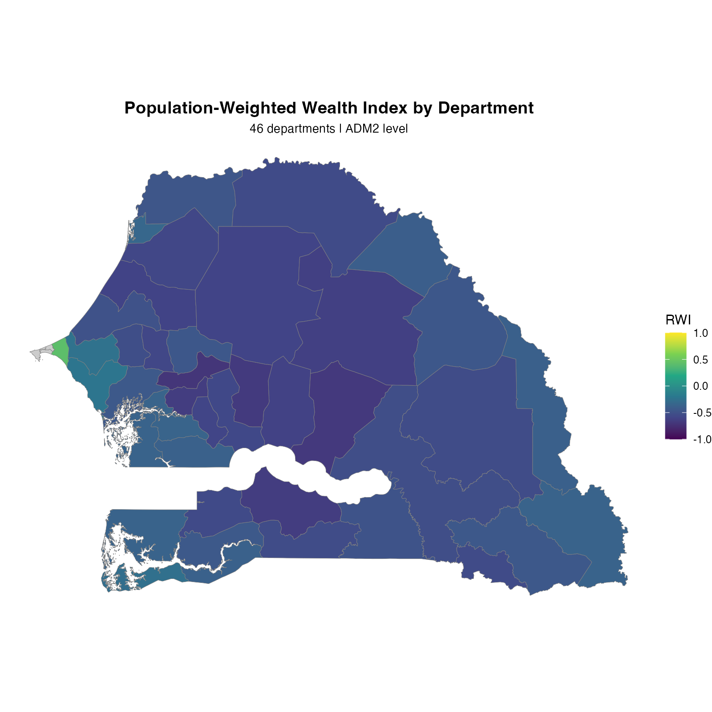
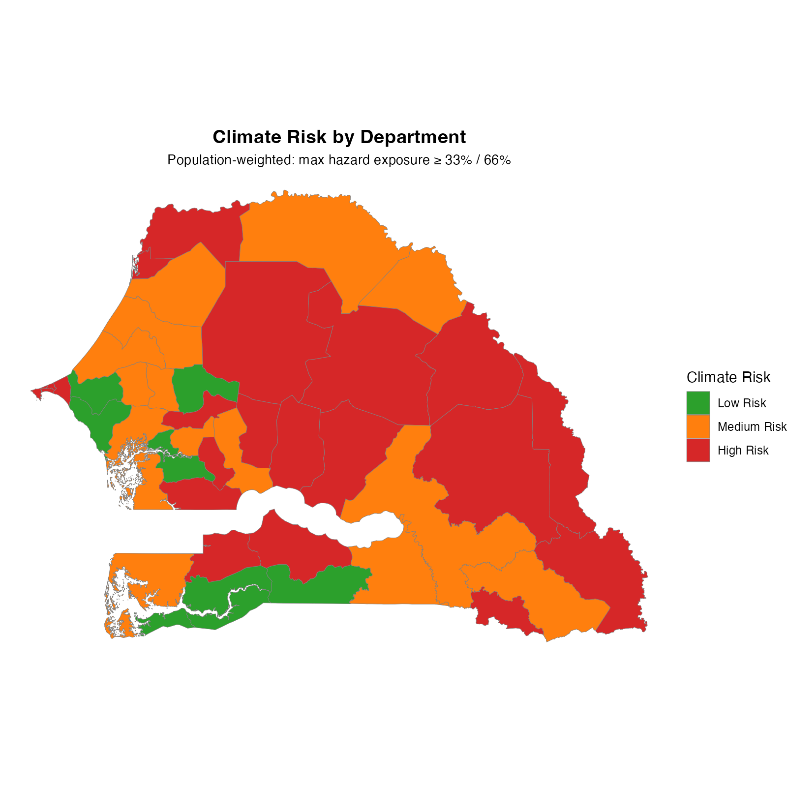
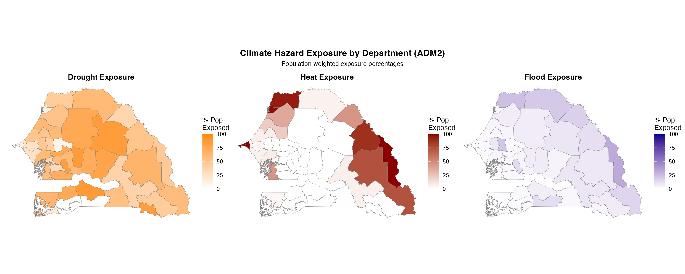
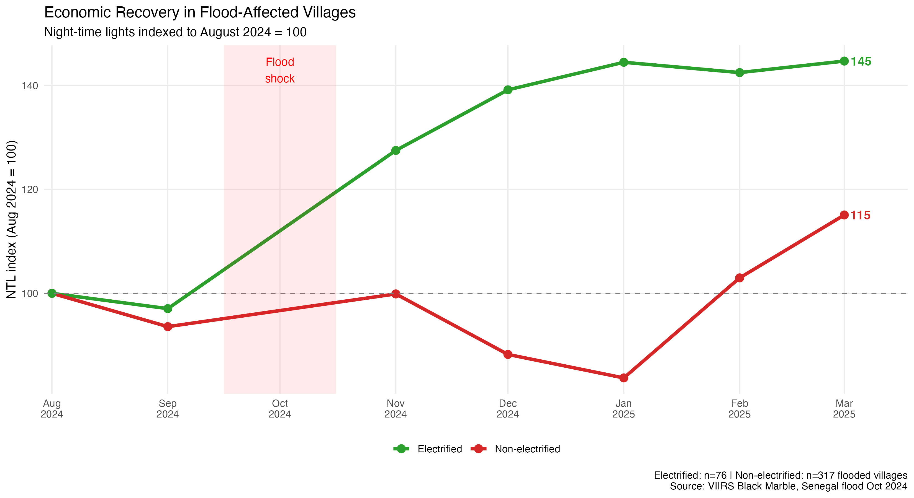
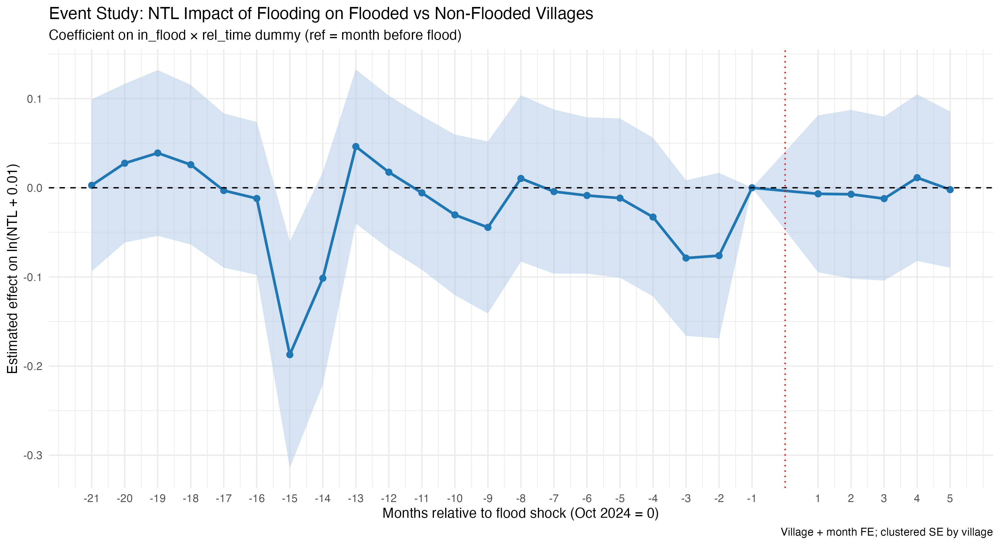
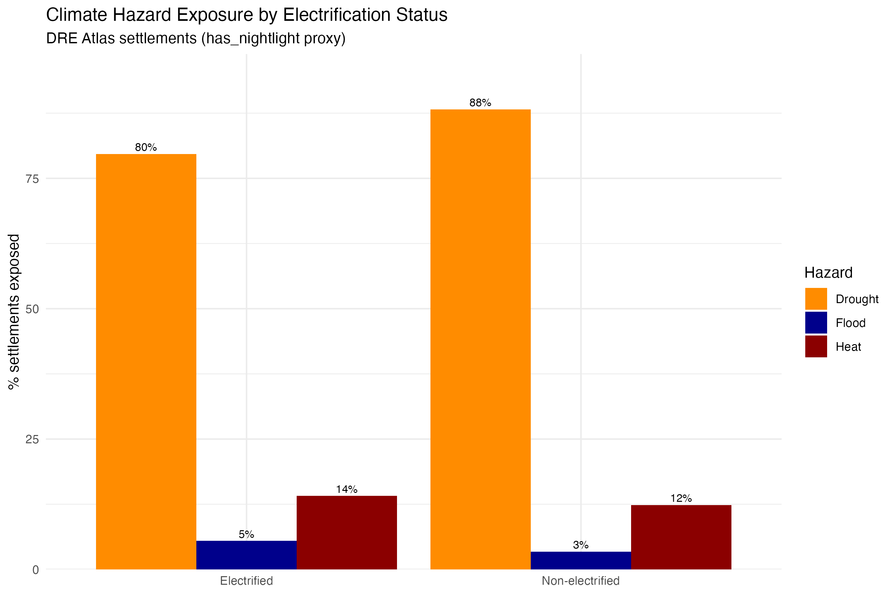

# Energy Access and Climate Vulnerability — Senegal

Analysing the intersection of rural electrification progress and climate risk in Senegal, using panel data from 2024–2025 energy surveys, open-source climate hazard rasters, and Meta's Relative Wealth Index.

**Research questions:**

1. Are communities that remain non-electrified disproportionately exposed to climate hazards (drought, heat, flood)?
2. Are newly electrified communities (2024–2025) located in poorer or wealthier departments?
3. Does electrification mode (grid, mini solar, solar home systems) correlate with climate risk?
4. Does economic recovery after a flood shock (measured via nighttime lights) differ by electrification status?

## National climate hazard exposure

Population-weighted share of Senegal's population living in an exposed pixel, by hazard type:

- **Drought:** 34.0%
- **Heat:** 34.0%
- **Flood:** 5.2%

## Wealth by department

Wealth (Meta's Relative Wealth Index, population-weighted to the department level) is highest around Dakar and the northwest coast, and lowest across the central and southeastern interior.

## Climate risk by department

Risk here is the maximum of the four population-weighted hazard exposure percentages (drought, heat, flood, cyclone), thresholded at 33% / 66%. High-risk departments cluster in the north (Sahelian drought/heat belt) and the east.

## Hazard exposure by type

Drought exposure is broad across the interior. Heat exposure is more concentrated — clustered around Dakar's urban core and the far eastern departments bordering Mali, with much of the central belt at effectively 0%. Flood exposure is comparatively low nationally but concentrated along the eastern river departments.

## Electrification and flood resilience

A separate, settlement-level analysis asks whether economic recovery after a flood shock — measured via nighttime lights — differs by electrification status. This uses a different unit of analysis (individual settlements, not departments) and a different time dimension (a monthly panel, Jan 2023–Mar 2025) than the department-level analysis above.

Electrification status here comes from the World Bank's [DRE Atlas](https://energydata.info/dataset/senegal-distributed-renewable-energy-dre) `has_nightlight` field (public, CC BY 4.0) rather than survey data — an earlier version of this analysis used a government energy access survey that cannot be published; DRE Atlas is a public substitute that supports the same fixed pre-period electrification grouping this design needs.

**Design:** village + month fixed-effects difference-in-differences on ln(NTL), comparing flood-affected vs. non-affected settlements before and after Senegal's October 2024 flood, split by whether a settlement was already electrified (n=19,316 settlements, 3,858 electrified).

Flood-affected electrified settlements recovered to 145% of their August 2024 nighttime-lights baseline by March 2025; flood-affected non-electrified settlements reached only 115%. The triple-interaction coefficient (flood × post-shock × electrified) is **+0.152 (p<0.0001, clustered by settlement)** — electrified settlements' relative nighttime-lights gain after the flood is significantly larger, net of both the general post-flood trend and any pre-existing gap between electrified and non-electrified settlements.

The event study shows flood-affected and non-affected settlements tracking closely in the pre-period — coefficients centered near zero with wide but stable confidence intervals — consistent with the parallel-trends assumption the DiD estimate relies on.

Electrified and non-electrified settlements have similar average hazard exposure (0.99 vs. 1.04 hazards per settlement) — the recovery gap above is about resilience, not a difference in baseline climate risk.

## Methods

RWI is aggregated from settlement-level point data to administrative boundaries using population weighting, so that the resulting score reflects where people live rather than a simple spatial average. Climate hazard exposure is similarly population-weighted: for each department, the percentage reported is the share of the modelled population living in an exposed pixel, not the share of land area.

Hazard extraction uses [`exactextractr`](https://github.com/isciences/exactextractr) for vectorised zonal statistics across all departments in a single pass.

The flood-resilience DiD uses [`fixest`](https://lrberge.github.io/fixest/) with village and month fixed effects, clustered standard errors by settlement, and the `post:electrified` interaction term (needed because `post` is collinear with month FE and `electrified` is collinear with village FE on their own, but their product is not).

## What this repository contains

| File | Description |
|------|-------------|
| `scripts/03_poverty_analysis.R` | Population-weighted RWI analysis at ADM1/ADM2 level; poverty targeting assessment for newly electrified communities |
| `scripts/04_comprehensive_analysis.R` | Combines RWI, climate hazard exposure, and electrification data at department level; produces the wealth × climate risk matrix |
| `data/README.md` | Data sources, licences, and download instructions |

Scripts 01 and 02 (data loading and cleaning) process energy access survey data held by a government partner and are maintained in a separate private repository — see the [full README](https://github.com/varshabsuresh/energy-climate-nexus#what-is-not-included) for details on what's included and what isn't. The flood-resilience panel scripts (NTL fetch, panel build, DiD/event-study analysis) use only public data (DRE Atlas, VIIRS Black Marble, VIIRS flood extent) and are not yet included in this repository.

## Data sources

| Dataset | Source | Licence |
|---------|--------|---------|
| Meta High Resolution Settlement Layer (population) | [HDX](https://data.humdata.org/dataset/highresolutionpopulationdensitymaps-sen) | CC BY 4.0 |
| Meta Relative Wealth Index | [HDX](https://data.humdata.org/dataset/relative-wealth-index) | CC BY 4.0 |
| WorldPop 2023 population (100m) | [WorldPop Hub](https://hub.worldpop.org) | CC BY 4.0 |
| Integrated climate hazard raster | [World Bank Reproducible Research Repository](https://reproducibility.worldbank.org/catalog/186) | Modified BSD3 |
| Flood depth raster | [HDX, UNOSAT](https://data.humdata.org/dataset/unosat-live-web-map-inondations-au-senegal) | CC BY 4.0 |
| DRE Atlas settlements | [DRE Atlas, World Bank Group](https://energydata.info/dataset/senegal-distributed-renewable-energy-dre) | CC BY 4.0 |
| VIIRS Black Marble nighttime lights (monthly) | [NASA Earthdata (VNP46A3)](https://appeears.earthdatacloud.nasa.gov) | Public domain |
| VIIRS flood extent (Oct 2024) | [HDX, UNOSAT](https://data.humdata.org/dataset/unosat-live-web-map-inondations-au-senegal) | CC BY 4.0 |
| World Bank Admin 0 boundaries | [World Bank](https://datacatalog.worldbank.org/dataset/world-bank-official-boundaries) | CC BY 4.0 |
| GADM Admin 1/2 boundaries | [World Bank Databank](https://datacatalog.worldbank.org/search/dataset/0038272/world-bank-official-boundaries) | CC BY 4.0 |

## License

Code in this repository is released under the MIT License. Datasets retain their original licences — see the table above.

## Contact

Questions or collaboration: [LinkedIn](https://www.linkedin.com/in/varshasureshb) or open an issue on the [repository](https://github.com/varshabsuresh/energy-climate-nexus).
