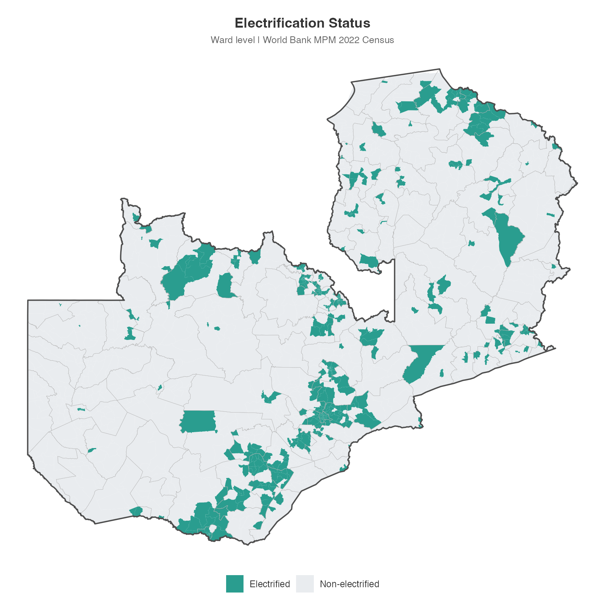
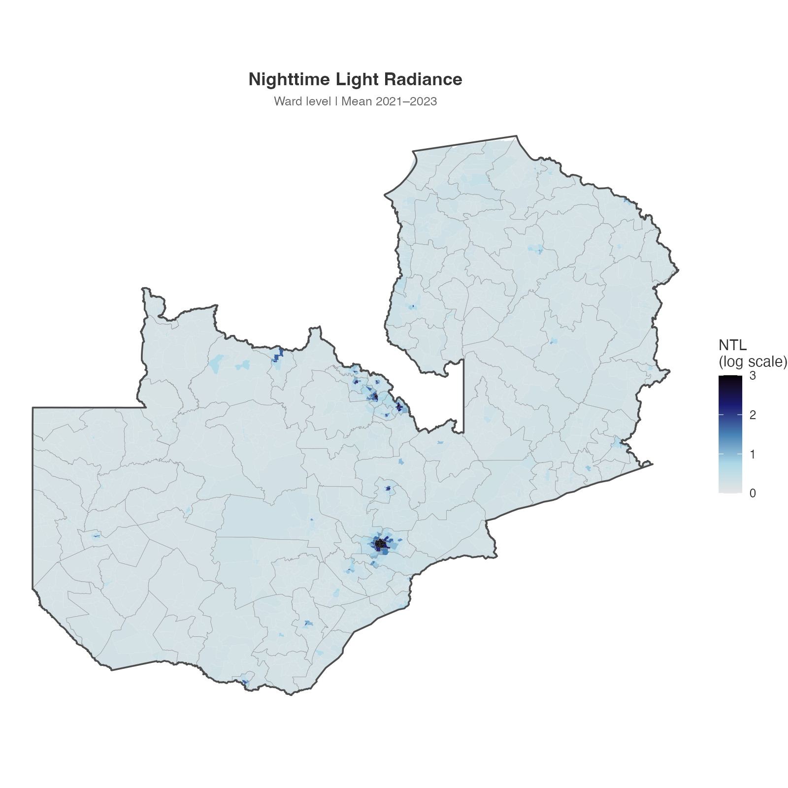
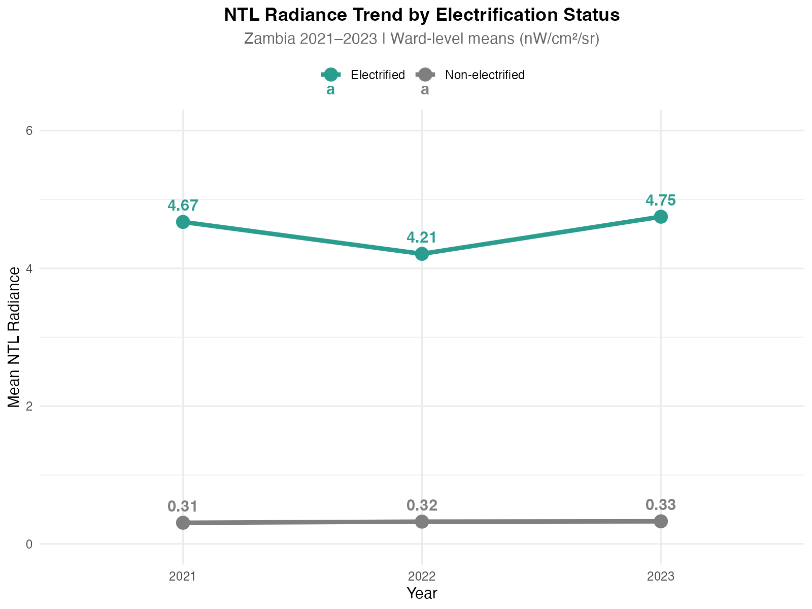
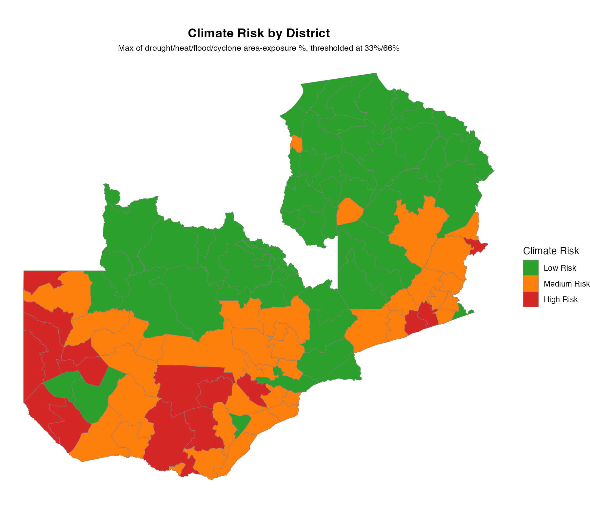
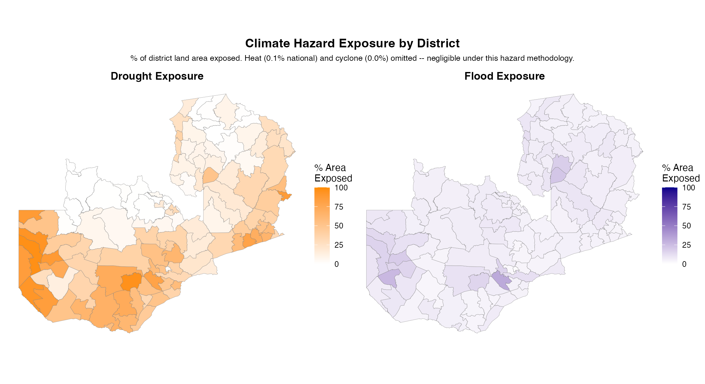

# Energy Access and Climate Vulnerability in Zambia

Mapping the intersection of rural electrification and climate hazard exposure in Zambia, using ward-level census electrification data, VIIRS nighttime lights, and World Bank climate hazard rasters.

**Research questions:**

1. How much brighter (via nighttime lights) are electrified wards compared to non-electrified ones?
2. Which districts face the highest climate hazard exposure, and how does that compare to where electrification gaps are concentrated?
3. What share of the population lives in non-electrified areas?

## Electrification status

Of Zambia's 1,858 wards, 541 (29.1%) are electrified, covering 48.3% of the population — meaning electrification is concentrated in higher-population wards. The remaining 1,317 wards (70.9%) are non-electrified, covering 51.7% of the population, concentrated in rural areas away from Lusaka and the Copperbelt.

## Nighttime lights by ward

Nighttime light radiance is heavily concentrated around Lusaka and the Copperbelt mining towns in the northeast, consistent with the electrification map above.

Electrified wards show roughly 14x higher mean nighttime-light radiance than non-electrified wards (4.5 vs. 0.3 nW/cm²/sr, averaged 2021–2023) — a consistency check that the electrification classification and the independent satellite signal agree.

## Climate risk by district

Risk is the maximum of drought/flood/cyclone area-exposure percentages, thresholded at 33%/66%. Of 116 districts: 61 Low, 39 Medium, 16 High risk. The highest-risk districts cluster in the southwest and south — Zambia's more arid regions.

## Hazard exposure by type

Drought is the dominant hazard nationally (31.4% of land area exposed), concentrated in the south and southwest. Flood exposure is lower (7.4%) and concentrated around wetland/river areas in the north and a pocket in the south. Heat (0.1%) and cyclone (0.0%) exposure are both negligible under this hazard methodology — plausible given Zambia's plateau elevation (mostly 1,000–1,500m) and landlocked position, and are excluded from the maps above as a result.

## Methods

Electrification status comes from World Bank Multidimensional Poverty Measure (MPM) 2022 Census ward-level deprivation indicators (`pct_dpr_el`, the share of the ward population without electricity access, thresholded at 50%). Nighttime lights are VIIRS annual composites (2021–2023), extracted as ward-level means.

Climate hazard exposure is area-weighted (% of district land area in an exposed pixel) using [`exactextractr`](https://github.com/isciences/exactextractr) for vectorised zonal statistics, derived from the World Bank's `dou_haz4` hazard composite raster.

## What this repository contains

| File | Description |
|------|-------------|
| `scripts/01_electrification_ntl.R` | Ward-level NTL extraction and electrification status mapping |
| `scripts/02_climate_hazards.R` | District-level climate hazard exposure and risk classification |
| `data/README.md` | Data sources and download instructions |

## Data sources

| Dataset | Source | Licence |
|---------|--------|---------|
| Ward deprivation / electrification (MPM 2022 Census) | World Bank | Public |
| VIIRS nighttime lights (annual composites) | Google Earth Engine / NASA VIIRS | Public domain |
| Integrated climate hazard raster | [World Bank Reproducible Research Repository](https://reproducibility.worldbank.org/catalog/186) | Modified BSD3 |
| World Bank Admin 0/2 boundaries | [World Bank](https://datacatalog.worldbank.org/dataset/world-bank-official-boundaries) | CC BY 4.0 |

## License

Code in this repository is released under the MIT License. Datasets retain their original licences — see the table above.

## Contact

Questions or collaboration: [LinkedIn](https://www.linkedin.com/in/varshasureshb) or open an issue on the [repository](https://github.com/varshabsuresh/energy-climate-nexus).
